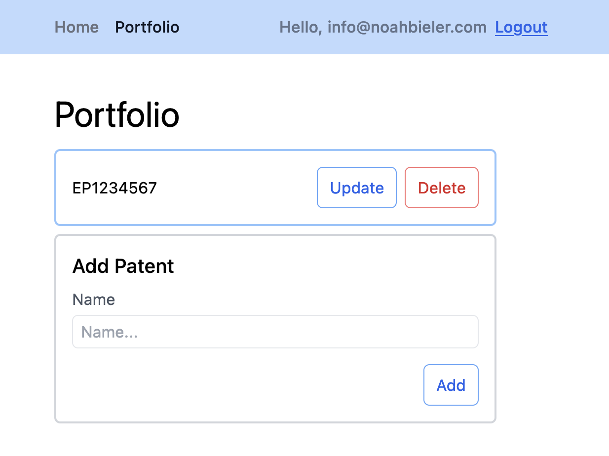

# Basic CRUD Web App with SvelteKit with Drizzle ORM, iron auth and Tailwind CSS

## Beyond React

Since I started with web development, React was
and still is considered to be the state of the art and I nevery really doubted it much.
The same is true for single page applications (SPA). They were the cool kid on the block
and everybody hailed them as the modern way of doing things.
Recently however, I started to really envy a bit the multip page application (MPA)
architecture (with server side rendering and more).

[In a previous article](https://www.noahbieler.com/blog/a-crud-web-app-using-nextjs-13-iron-session-and-prisma)
I was looking at how to create a basic CRUD Web App
using [Next.js 13](https://nextjs.org). 
It was a nice experience developing it as MPA.
However, I recently stumbled on 
[this blog post](https://joshcollinsworth.com/blog/antiquated-react).
It compares React to Java: both became a quasi standard in the industry
and it seems to be that people are very slow at looking, learning and adopting newer paradigms.
At the end, the author suggests to try out some of the other Javscript frameworks out there,
especially [Svelte](https://svelte.dev) and [SvelteKit](https://kit.svelte.dev).
This article is now the product of my trying them out and seeing 
[how they compare to React](https://joshcollinsworth.com/blog/introducing-svelte-comparing-with-react-vue)
and Nextjs.

## Example CRUD app with Svelte, Iron and Drizzle ORM

Similar to the [last time](https://www.noahbieler.com/blog/a-crud-web-app-using-nextjs-13-iron-session-and-prisma), 
I have created an example web app with authentication
using [`iron`](https://github.com/hapijs/iron), 
a database connection to [SQLite](https://www.sqlite.org/index.html) 
using [Drizzle ORM](https://orm.drizzle.team),
and some basic CRUD functionality to add, update and delete enitites (patents here).
You can find the code [here on GitHub](https://github.com/bielern/svelte-patent-cockpit).
I will use some snippets from it to highlight some points in the following sections.

## Svelte in comparison to React

The first thing that stood out for me was that Svelte code feels "flatter"
than React code. React code seems to always yield very deeply nested code 
(e.g. the famous provider stack).
Svelte code is very declarative while React code is basically a big pile of function
calls. 
A Svelte file has the code, the html template and the style 
as three different "sections" within the file and looks something like this 
```
<script>
  // here is the JS code
</script>

<!-- here is the HTML-->
<h1>Hello world</h1>
<p>Some more text here</p>

<!--Some optional, component-scoped styling follows here -->
<style>
  ...
</style>

```

In React, the state management heavily relies on the `useState` hook, props being
passed around and `Context`. 
These `Context`s are use to avoid passing around props and state
from components living high up in the hierarchy (where the state lives) 
to components deep down in the hierarchy (where the state is used and changed).
Svelte on the other hand uses two-way bindings and stores to achieve the same.
Reactive variables have to be declared explicitly as such (using `$:`).
In React, on the other hand, variables defined in components are in general 
recalculated as the props change. 
Because of this recalculations React might become slow as large parts of the (virtual)
DOM tree are recalculated although only a small portion actually changes.

## A login screen using a simple HTML form

Svelte tries also to adhere more to web standards for forms etc. --
 similar to like [Remix](https://remix.run) does. 
Thus, you can easily create web apps 
that do not necessarily rely on Javascript for running.
In my example app, the page code for the login form looks like this 
(without the [Tailwind CSS](https://tailwindcss.com) classes)
```
<script lang="ts">
  import {enhance} from '$app/forms';
  import  type { ActionData } from './$types'; // auto-generated types

  export let form: ActionData
</script>

<h1>Login</h1>

<form method="POST" use:enhance>
  <label>
    Email
    <input name="email" type="email">
  </label>
  <label>
    Password
    <input name="password" type="password">
  </label>
  <button>Log in</button>
</form>

{#if form?.error}
<div>{form.error}</div>
{/if}

<a href="/signup">No login? Sign up!</a>
```
It's a very basic Login form with email and password. 
In order to `enhance` it a bit, some Javascript has been added that can 
help show an error if one is returned from the login end point.
But the general login flow would work even if the client would have switched off
Javascript.
Also, note that you navigate using simple `<a>` links instead of dedicated `<Link>`
components like for Next.js or Remix.


## CRUD with forms

Similar to the login forms, the CRUD functionalities for creating, updating and deleting
patents are also implemented with basic forms (again not showing the Tailwind CSS classes for styling)
```
<script lang="ts">
    export let data
</script>

<h1>Portfolio</h1>

<div>
{#each data.portfolio as patent (patent.id)}
    <form method="POST" action="?/post">
        <input type="hidden" name="id" value={patent.id} />
        <input type="text" value={patent.name} name="name" />
        <input type="submit" value="Update" />
        <input type="submit" value="Delete" formaction="?/delete" />
    </form>
{/each}

<form method="POST" action="?/post">
    <h2>Add Patent</h2>
    <label> Name
        <input type="text" name="name" placeholder="Name..." />
    </label>
    <button>Add</button>
</form>
</div>
```



The `export let data` defines the data that is being returned by the server side `load` function (see below)
and contains the patents array (or the "Portfolio").
We then loop over each patent and show it with a card with the name.
The name can be updated or we can delete it.
At the end of the list, there is a form to add a new patent.
The `formaction` field (on the button) or `action` field (on the form) are used to trigger
the correct action on the server.
Again, no particular Javascript is used for handling the form itself.

The corresponding actions are defined on the server as
```
import { deletePatent, postPatent, getPatents } from '$lib/server/patents.js'

export const load = async ({locals}) => {
    return { portfolio: getPatents(locals.session.user) }
}

export const actions = {
    post: async ({request, locals}) => {
        const formData = await request.formData()
        const name = formData.get('name') as string
        const id = parseInt(formData.get('id') as string)
        const {session: {user}} = locals
        postPatent({name, id: isNaN(id) ? undefined : id, user})
    },
    delete: async ({request, locals}) => {
        const formData = await request.formData()
        const id = parseInt(formData.get('id') as string)
        const {session: {user}} = locals
        deletePatent({id, user})
    }
}
```
The `load` function "fills" the `data` in the first file.
The actions `post` and `delete` are the ones triggered by the forms (as `?/post` and `?/delete`).
The `locals` variable contains the session data and has been filled by a server hook
(kind of a "middleware"):
```
import { redirect, type Handle } from '@sveltejs/kit';
import { getSession } from '$lib/server/session';
import { SESSION_PASSWORD } from '$env/static/private';

// all the routes under (auth)
const unprotected = /^\/(login|logout|signup)$/;

export const handle: Handle = async ({ event, resolve }) => {
    if (!unprotected.test(event.url.pathname)) {
        const cookies = event.cookies
        const session = await getSession(cookies, SESSION_PASSWORD)
        if (!session) {
            throw redirect(303, '/login')
        }
        event.locals.session = session
    }
    const response = await resolve(event);
    return response;
}
```
This hook looks at every request coming to the server. 
If the request is for a protected page, it checks if there is a valid session cookie. 
If it is present, the session gets added to the `locals` variable; if not, the 
client is redirected to the `/login` page.

## Authentication with `iron`

The authentication is pretty much the same as for the React example app.
One nice thing though is that I didn't need to rely on a wrapper library around
`iron` as Svelte makes it quite easy to simply use the most basic JS libraries
without any special React or Nextjs wrapper around it.

Transforming sessions into cookie strings and back is done as follows:
```
import Iron from '@hapi/iron';

export type Session = {
    user: string
}

// password must only live on the server
export async function session2cookie(session: Session, password: string): Promise<string | undefined> {
    const sealed = await Iron.seal(session, password, Iron.defaults);
    return sealed;
}

export async function cookie2session(cookie: string, password: string): Promise<Session | undefined> {
    const unsealed = await Iron.unseal(cookie, password, Iron.defaults);
    return unsealed;
}
```
and to create a session or get a session from a `Cookie`, we use
```
import argon2 from 'argon2'

import type { Cookies } from "@sveltejs/kit";
import { getUser, addUser } from './users';

export const session_cookie_name = 'session'
export async function getSession(cookies: Cookies, password: string): Promise<Session | undefined> {
    const cookie = cookies.get(session_cookie_name)
    return cookie ? cookie2session(cookie, password) : Promise.resolve(undefined)
}

export async function createSession(email: string, password: string, register: boolean) {
    const user = getUser(email)
    if (user) {
        const the_same = await argon2.verify(user.hashed_password, password)
        if (the_same) return {user: email}
        else return undefined
    } else if(register) {
        const hashed_password = await argon2.hash(password)
        addUser({email, hashed_password})
        return {user: email}
    } else {
        return undefined
    }
}
```

## Connecting to a SQLite Database with Drizzle ORM

As a DB solution I wanted to try out [Drizzle ORM](https://orm.drizzle.team) 
with [SQLite](https://www.sqlite.org/index.html) instead of 
[Prisma.io](https://www.prisma.io) and [Postgres](https://www.postgresql.org).
It felt pretty nice to work with. 

First, I defined the schema for the users and patents table.
Then, I infered the types for the entities from the schema.
```
import type { InferModel } from 'drizzle-orm';

import { integer, sqliteTable, text } from 'drizzle-orm/sqlite-core';

export const users_table = sqliteTable('users', {
    email: text('email').notNull().primaryKey(),
    hashed_password: text('hashed_password').notNull(),
})

export type User = InferModel<typeof users_table>

export const patents_table = sqliteTable('patents', {
    id: integer('id', { mode: 'number' }).primaryKey({ autoIncrement: true }),
    name: text('name').notNull(),
    user: text('user').notNull().references(() => users_table.email, { onDelete: 'cascade' }),
})

export type Patent = InferModel<typeof patents_table>
export type NewPatent = InferModel<typeof patents_table, 'insert'>
```
The `user` on the patents table is a foreign key. In order to make the `ON DELETE CASCADE` to work,
make sure that you switch on the necessary pragma in SQLite
```
PRAGMA foreign_keys = ON;
```
Another nice thing is that you can infer the types from the schema. 
And not only the type of when the entity is in the database (`Patent`), 
but also the type for inserting into the DB (`NewPatent`).

Migrations are handled also quite elegantly. 
You create them with `drizzle-kit`:
```
npx drizzle-kit generate:sqlite --schema=src/lib/server/schema.ts --out=src/lib/server/migrations
```
Once created, they can be run automatically,
when the database connection is created during the server startup
```
const sqlite = new Database('sqlite.db');
export const db: BetterSQLite3Database = drizzle(sqlite);

migrate(db, { migrationsFolder: 'src/lib/server/migrations' });
```

## Conclusion

All in all, it was quite a pleasant experience to create this web app.
I could imagine very well how more and more developers will move to Svelte from
React and that it might be even adopted by the business side at one point.
Drizzle ORM was also pleasant to work with, 
although the documentation is still a bit sparse; 
some of the solutions (like the `InferModel` for `insert`) I only found by accident.

If you want to try it again yourself, either
check my code on [GitHub](https://github.com/bielern/svelte-patent-cockpit) or
get started with the amazing [Svelte tutorial](https://learn.svelte.dev/tutorial/welcome-to-svelte).
